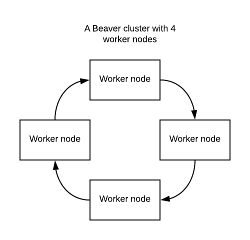

# Beaver System Architecture

Beaver aims to be scalable, easy to use and maintain.

You can add as many nodes as you want. For a node to join the cluster it needs to know the
cluster token which can be automatically generated or manually set in config.

## High Availability

This design allows you to have nodes in different availability zones, ensuring a reliable
Beaver installation.

## Task coordination

There is no master node to coordinate jobs as tasks are picked up from a queue.

## Monitoring

Out of the box Beaver gives you monitoring to know what's going on in your cluster.
